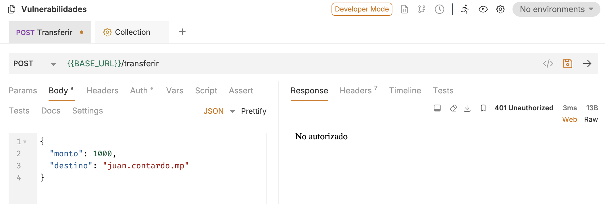
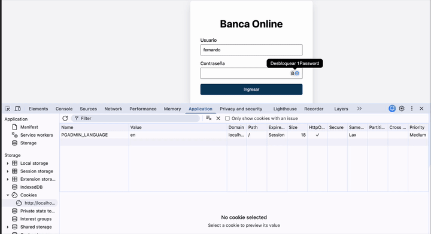
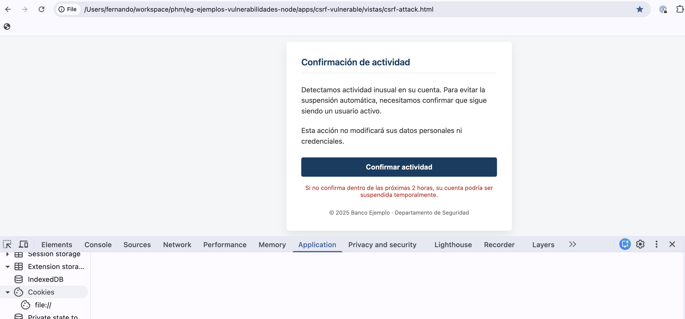
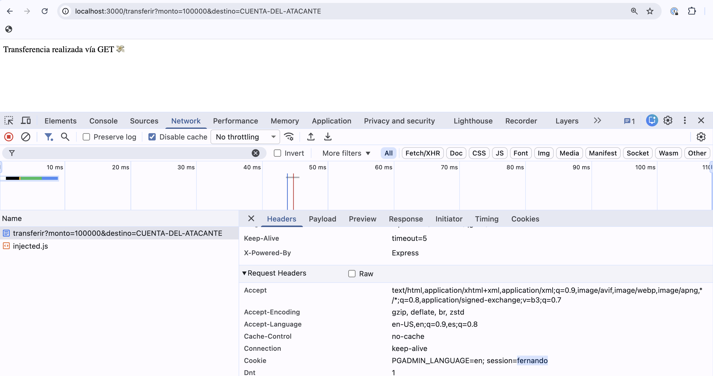
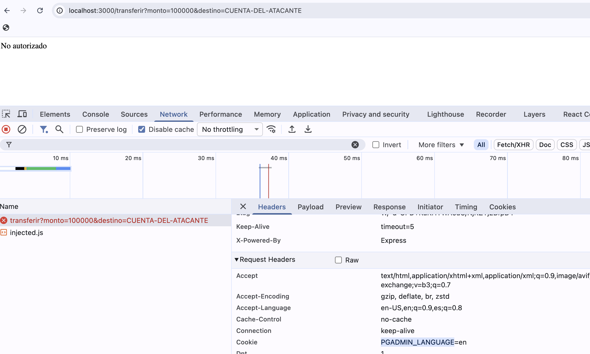

# CSRF Vulnerable

## El server

Para levantar el server, desde el directorio raíz hacemos:

```bash
pnpm --filter csrf-vulnerable dev:watch
🔥 Server vulnerable en http://localhost:3000
```

El server ofrece dos endpoints:

- login
- transferir
- acompañado de vistas html para cada caso de uso

## Transferencia sin estar logueado

El server valida que no puedas transferir dinero sin estar logueado. De manera que si en Bruno intentás hacer un

POST - http://localhost:3000/transferir

pasando como body 

```json
{
  "monto": 1000,
  "destino": "juan.contardo.mp"
}
```

Vamos a recbir un error 401 (No autorizado): no puedo validar que sea yo quien está haciendo la transferencia.



## Uso de la app

Ahora sí nos vamos a loguear en la app, con las credenciales del usuario `fernando` y contraseña `1234`

```bash
http://localhost:3000/login
```

No hace falta enviar nada en el body. Luego simulamos una transferencia:




## Ataque CSRF

El archivo [csrf-attack.html](./app-atacante/csrf-attack.html) simula un típico ataque CSRF: a veces es un mail con un `<form>`, a veces es un `<link>` en una página web, etc. Al abrir el archivo (arrastralo directamente al navegador) nos aparece un típico mensaje de ingeniería social, que suele tener frases alarmistas, con carga emocional, una urgencia artificial, que requiere una acción inmediata.

Presos de la ansiedad, hacemos click en el botón que inadvertidamente envía la orden de transferir a la cuenta del atacante.



## Qué hace el ataque

> CSRF no roba cookies. Usa cookies legítimas para hacer cosas ilegítimas.

En este caso, el atacante manda un archivo con un `<form>` que envía la orden de transferir a la cuenta del atacante **tratando de aprovecharse de una cookie existente**.

## Por qué no funciona el ataque

Nuestro server solo valida que exista una cookie

```ts
app.post('/transferir', (req, res) => {
  const user = req.cookies.session
  if (!user || !USERS[user]) {
    return res.status(401).send('No autorizado')
  }
```

Entonces, ¿por qué el ataque no funciona?

En el endpoint de login, una vez validado el usuario y la contraseña, generamos una cookie que viaja al cliente, con el dato del usuario y con alguna configuración adicional.

```ts
app.post('/login', (req, res) => {
  const { user, password } = req.body
  ...
  res.cookie('session', user, {
    httpOnly: true,
    sameSite: 'lax', // 'lax' es el valor por defecto
  })
```

- **httpOnly**: activada, evita que la cookie pueda ser accedida desde JavaScript. Pero ésto lo veremos más adelante cuando hagamos un ataque XSS.
- **sameSite**: 'lax', evita que la cookie se envíe cuando se haga una navegación cruzada en pedidos que no sean GET (el origen sea distinto al de la página). Hay tres valores posibles: 'lax', 'strict' y 'none'. 'lax' es el valor por defecto y es el que usamos en este ejemplo.

## Qué pasa si tenemos un endpoint GET para transferir

Agreguemos un endpoint GET para transferir

```ts
app.get('/transferir', (req, res) => {
  const user = req.cookies.session
  if (!user || !USERS[user]) {
    return res.status(401).send('No autorizado')
  }

  USERS[user].saldo -= Number(req.body.monto || 0)
  res.send('Transferencia realizada vía GET 💸')
})
```

y usemos el segundo método de ataque CSRF [haciendo un pedido GET](./app-atacante/csrf-attack-get.html). El ataque **funciona**, porque la cookie con SameSite=Lax se envía en el pedido GET.



## Configuración SameSite para la cookie

Dijimos anteriormente que había tres tipos de configuración para el atributo SameSite:

- 'lax', que es el valor por defecto
- 'strict'
- 'none', que fuerza a usar https (atributo Secure=true)

Si cambiamos la configuración de la cookie a 'strict', el ataque no funcionaría, porque la cookie no se envía si el origen es distinto al de la página **en ningún caso**, mientras que 'lax' nos deja enviar la cookie en pedidos GET.

Hacemos el cambio en el login:

```ts
app.post('/login', (req, res) => {
  const { user, password } = req.body
  ...
  res.cookie('session', user, {
    httpOnly: true,
    sameSite: 'strict', // 'lax' es el valor por defecto
  })
```

Y vemos que el ataque ahora no funciona:



## BONUS: La forma correcta de prevenir CSRF

Vamos a dejarte la explicación de una implementación posible del token CSRF. 

### El login devuelve un token CSRF

```ts
import crypto from 'crypto'

const csrfTokens = new Map<string, string>()

app.post('/login', (req, res) => {
  const { user, password } = req.body
  if (!USERS[user] || USERS[user].password !== password) {
    return res.status(401).send('Credenciales inválidas')
  }

  const csrfToken = crypto.randomUUID()
  csrfTokens.set(user, csrfToken)

  res.cookie('session', user, { httpOnly: true })
  res.send({ csrfToken })
})
```

Fíjense que el endpoint de login devuelve

- la cookie con la información del usuario logueado
- pero también el token CSRF (con el formato json: `{ csrfToken: 'token' }`)

El token CSRF es un valor aleatorio que se genera en el servidor y se envía al cliente. 

### El frontend guarda el token CSRF

Dado que la cookie se envió como httpOnly, el frontend no puede acceder a ella. Por eso el server devuelve **aparte** el token CSRF, que el frontend puede guardar en memoria (por ejemplo en localStorage).

```ts
const csrfToken = /* recibido del login */
```

Eso nos permite que en el pedido de transferencia, el frontend pueda incluir el token CSRF en el header.

```ts
fetch('/transferir', {
  method: 'POST',
  headers: {
    'Content-Type': 'application/json',
    'X-CSRF-Token': csrfToken
  },
  body: JSON.stringify({ monto: 1000 })
})
```

### El server valida el token CSRF en la transferencia

Veamos cómo queda el código del endpoint de transferencia:

```ts
app.post('/transferir', (req, res) => {
  const user = req.cookies.session
  if (!user) {
    return res.status(401).send('No autorizado')
  }

  const expected = csrfTokens.get(user)
  const received = req.headers['x-csrf-token']

  if (!expected || received !== expected) {
    return res.status(403).send('CSRF detectado')
  }

  USERS[user].saldo -= Number(req.body.monto)
  res.send('Transferencia realizada')
})
```

No solo chequeamos que el usuario esté logueado, sino que el token CSRF que envía el cliente sea igual que el que el server envió. Para ello, cada user tiene su propio token CSRF y lo consultamos en el mapa `csrfTokens`.

## Por qué un atacante no puede acceder al token CSRF

Un atacante no puede acceder al token CSRF porque el navegador aplica la
**Same-Origin Policy**.

El token CSRF está almacenado (por ejemplo) en el `localStorage` del origen
`http://localhost:3000`. Solo el código JavaScript que se ejecute **desde ese mismo origen** puede leer ese valor.

La página atacante se ejecuta en **otro origen** (por ejemplo `file://`, `http://evil.com`, etc.), por lo que:

- no puede leer el `localStorage`
- no puede acceder a cookies
- no puede inspeccionar respuestas del servidor

Aunque el atacante puede inducir al navegador a **enviar una request** al sitio víctima, **no puede obtener ni reutilizar el token CSRF**, y por eso el backend puede detectar y bloquear el ataque.

## Links

- [XSS Stored](../xss-stored/)
- [XSS Reflected](../xss-reflected/)
- [XSS DOM Based](../xss-dom-based/)
- [Página principal](../..)