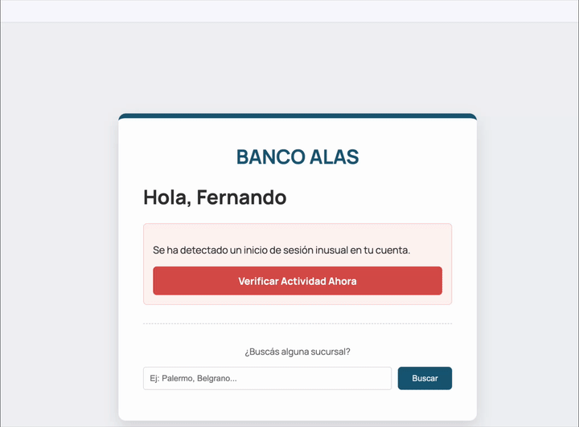

## Reflected XSS

Este tipo de XSS ocurre cuando la aplicación incluye datos de entrada del usuario directamente en la respuesta sin sanitizarlos.

## Levantando el server

Desde la carpeta raíz del proyecto

```bash
cd apps/xss-reflected/server
pnpm dev
🚀 XSS Reflected en puerto 3001
```

## Levantando el cliente

Nuevamente desde la carpeta raíz

```bash
cd apps/xss-reflected/client
pnpm dev
  VITE v5.2.11  ready in 71 ms

  ➜  Local:   http://localhost:5173/
  ➜  Network: use --host to expose
  ➜  press h + enter to show help
```

## El ejemplo

Navegamos desde un navegador a la URL `http://localhost:5173/search.html`



Vemos un mensaje de ingeniería social, con un botón que nos invita a hacer click. Cuando lo hacemos, disparamos la consulta al server que "refleja" el payload con el ataque XSS.

## El problema

El inconveniente está claramente en el servidor:

```ts
app.get('/search', (request, response) => {
  const searchTerm = request.query.query || ''

  // Usamos un Template String limpio para el SSR
  response.send(`
        <!DOCTYPE html>
        ...
        <body>
            <div class="card">
                <div class="logo">BANCO ALAS</div>
                <div class="result-container">
                    <p>Usted buscó: <span class="search-term">${searchTerm}</span></p>
                    <p>No se encontraron sucursales para su búsqueda.</p>
                </div>
                <a href="http://localhost:5173/search.html" class="back-link">← Volver al inicio</a>
            </div>
        </body>
        </html>
    `)
})
```

`searchTerm` se inyecta directamente en el HTML sin sanitización, lo que deja la puerta abierta a que se ejecute cualquier código

## Cómo evitar el ataque XSS reflected

Para evitar el ataque una vez más podemos usar

- bibliotecas como [DOMPurify](https://github.com/cure53/DOMPurify) o [sanitize-html](https://www.npmjs.com/package/sanitize-html)
- funciones de sanitización personalizadas como la que usamos anteriormente: `sanitizeHtmlInput`

En este caso usaremos DOMPurify. En el archivo `server/src/reflected.ts`:

```ts
// Importar DOMPurify
import DOMPurify from 'isomorphic-dompurify'

// En la ruta /search
const searchTerm = DOMPurify.sanitize(request.query.query || '')
```

Una vez hecho el cambio ingresamos a `http://localhost:5173/search.html` y al presionar el botón fíjense que ya no nos salta el alert.

## Características de este tipo de ataque

Este ataque se da en aplicaciones con Server Side Rendering (SSR) donde el servidor construye el HTML y se lo envía al cliente.

## Links

- [CSRF](../csrf-vulnerable/)
- [XSS Stored](../xss-stored/)
- [XSS DOM Based](../xss-dom-based/)
- [Página principal](../..)