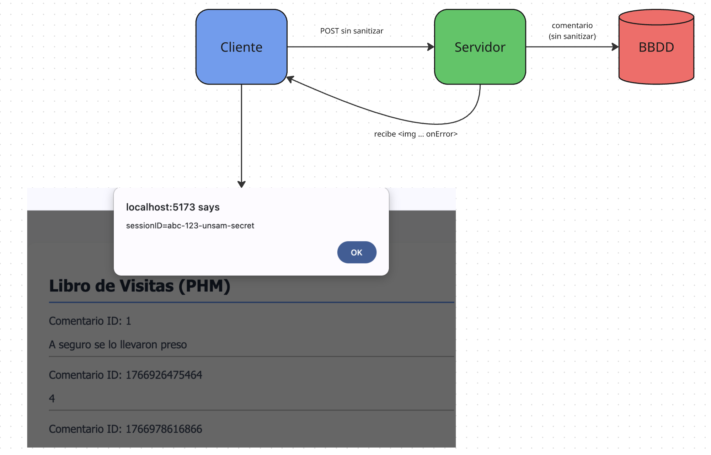
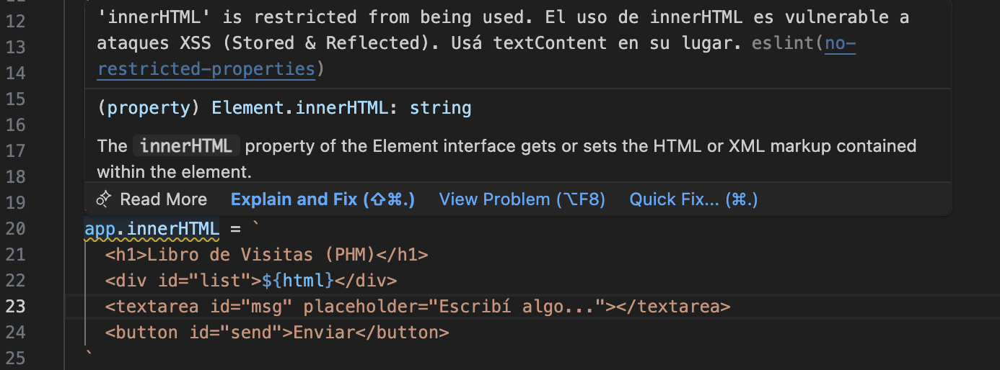
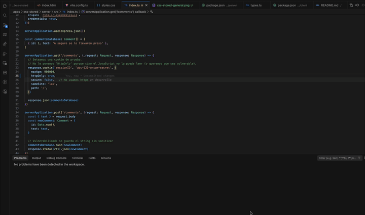

# Ejemplo XSS Stored

## Análisis

Este ejemplo demuestra una vulnerabilidad XSS Stored donde los comentarios se almacenan en la base de datos y se muestran sin sanitización, permitiendo la ejecución de scripts maliciosos.



La vulnerabilidad ocurre porque el contenido del comentario se inserta directamente en el DOM usando `innerHTML`, lo que permite que cualquier HTML o JavaScript incluido en el comentario sea ejecutado por el navegador del usuario.

## Levantando el server

```bash
pnpm --filter @vulnerabilities/xss-stored-server dev
```

## Levantando el cliente

```bash
pnpm --filter @vulnerabilities/xss-stored-client dev
```

## Forzando la vulnerabilidad

Si escribimos en el text area el siguiente payload:

```html

```

Esto implica definir un tag image cuyo fuente es inválido: `x` no compila, lo que dispara el evento `onerror` que ejecuta código javascript donde se muestra la información sensible del usuario.

Otra variante graciosa puede ser:

```html

```

que hace desaparecer el botón para enviar comentarios.

## BONUS: definiciones compartidas

La interface `Comment` está en un directorio shared, compartido entre cliente y servidor. Eso permite no tener que definir la misma interfaz en ambos lados.

## El Linter nos está avisando

Si se fijan en el archivo [main.ts](./client/src/main.ts), verán que el linter detecta el uso de `innerHTML` como una práctica no segura.



Esto es porque configuramos una regla custom en el archivo [eslint.config.js](../../eslint.config.js):

```ts
    rules: {
      ...
      'no-restricted-properties': [
        'warn',
        {
          property: 'innerHTML',
          message: 'El uso de innerHTML es vulnerable a ataques XSS (Stored & Reflected). Usá textContent en su lugar.'
        }
      ],
```

En general es una buena práctica endurecer las reglas de linter para prevenir vulnerabilidades de seguridad.

## Cookies con httpOnly false

Al crear la cookie estamos permitiendo que se acceda a la información sensible del usuario desde scripts maliciosos. En el archivo [index del server](./server/src/index.ts)

```ts
serverApplication.get('/comments', (_request: Request, response: Response) => {
  // Seteamos una cookie de prueba. 
  // No le ponemos 'HttpOnly' porque sino el JavaScript no la puede leer (y queremos que sea vulnerable).
  response.cookie('sessionID', 'abc-123-unsam-secret', {
    ...
    httpOnly: false, // Permitimos que JS la lea para la demo
    ...
  })
```

Si nosotros cambiamos la configuración a httpOnly: true, el atacante ya no podría leer la cookie desde JavaScript, lo que mitigaría el riesgo de XSS.



## Cómo prevenir el ataque XSS

### Del lado cliente 

- **Evitar `innerHTML`**: Usar `textContent` en su lugar para insertar texto plano.
- **Crear elementos DOM de forma segura**: En lugar de insertar HTML directamente, crear elementos y nodos de texto de forma programática.

Podés ver el ejemplo solucionado en [mainFixed.ts](./client/src/mainFixed.ts):

```ts
const commentsListContainer = document.querySelector<HTMLDivElement>('#comments-list-container')!
const commentInputArea = document.querySelector<HTMLTextAreaElement>('#comment-input-area')!
const sendCommentButton = document.querySelector<HTMLButtonElement>('#send-comment-button')!

const loadComments = async (): Promise<void> => {
  const serverResponse = await fetch('http://localhost:3000/comments', {
    credentials: 'include',
  })
  const commentsList: Comment[] = await serverResponse.json()
  
  // Limpiamos solo el contenedor de la lista, no toda la app
  commentsListContainer.textContent = '' 

  const commentElements = commentsList.map((comment: Comment) => {
    const cardContainer = document.createElement('div')
    cardContainer.className = 'comment-card'

    const idLabel = document.createElement('p')
    idLabel.className = 'comment-id'
    idLabel.textContent = `Comentario ID: ${comment.id}`

    const textContentDiv = document.createElement('div')
    // DEFENSA: textContent trata el payload como texto literal
    textContentDiv.textContent = comment.text 

    cardContainer.appendChild(idLabel)
    cardContainer.appendChild(textContentDiv)
    
    return cardContainer
  })

  commentsListContainer.append(...commentElements)
}
```

Ya con esos cambios podés ver que el payload XSS no se ejecuta porque `textContent` trata el contenido como texto plano: `http://localhost:5173/fixed`.

### En el servidor

- **Sanitizar la entrada**: Limpiar y validar toda la entrada del usuario antes de guardarla
- **Configurar cookies**: Usar `httpOnly: true` para evitar que JavaScript acceda a las cookies sensibles.


En el endpoint que crea los comments, agregamos la función de sanitización:

```ts
serverApplication.post('/comments', (request: Request, response: Response) => {
  const { rawText } = request.body
  const text = sanitizeHtmlInput(rawText)
  ...
```

La función de sanitización es bastante simple: 

```ts
export const sanitizeHtmlInput = (rawString: string): string => {
  const charactersMap: Record<string, string> = {
    '&': '&amp;',
    '<': '&lt;',
    '>': '&gt;',
    '"': '&quot;',
    '\'': '&#x27;',
    '/': '&#x2F;',
  }

  // Reemplazamos cada caracter sospechoso por su versión segura
  return rawString.replace(/[&<>"'/]/g, (match: string) => charactersMap[match])
}
```

Si querés algo más elaborado, tenés bibliotecas como [DOMPurify](https://github.com/cure53/DOMPurify) o [sanitize-html](https://www.npmjs.com/package/sanitize-html).

